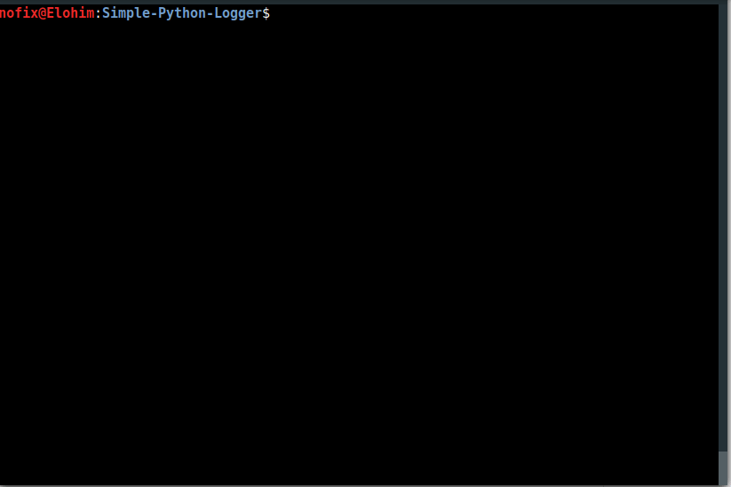
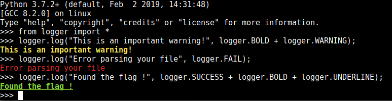

# Mini logger
A simple python logger. Easy to use.

## Installation

pip install minilogger

## Usage

```Python
from logger import *

if __name__ == "__main__":
  logger.log("This is an important warning!", logger.BOLD + logger.WARNING);
```


